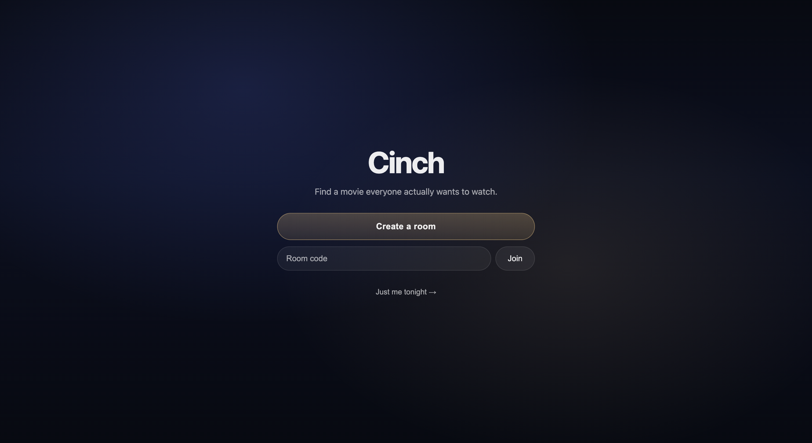
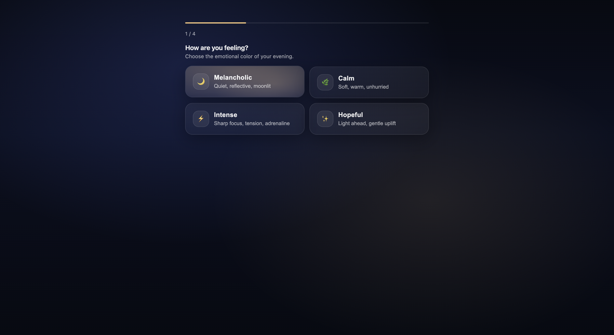
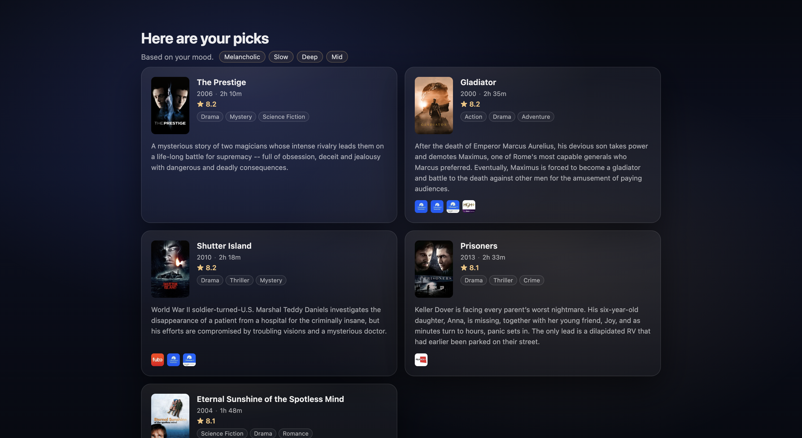

#  Cinch

**Find a movie everyone actually wants to watch.**

🔗 [cinch-vert.vercel.app](https://cinch-vert.vercel.app)

Cinch is a group movie-matching web app. One person creates a room, shares the link, and everyone answers a few questions about their mood. Cinch finds films that work for the whole group — no arguing, no endless scrolling.

---

## Screenshots





---

## How it works

1. **Create a room** — you get a short shareable code like `AMBER-7`
2. **Share the link** — everyone opens it on their own device
3. **Answer 4 questions** — feeling, pace, depth, era
4. **Get results** — Cinch finds movies that match everyone's vibe

Works solo too — skip the room and go straight to your picks.

---

## Tech stack

- **React + TypeScript + Vite** — frontend
- **Tailwind CSS** — styling
- **Supabase** — database and real-time sync
- **TMDB API** — movie data
- **Vercel** — deployment

---

## Local development

### Prerequisites

- Node.js 18+
- A [Supabase](https://supabase.com) project
- A [TMDB](https://www.themoviedb.org/settings/api) API key

### Setup

```bash
git clone https://github.com/yourusername/cinch.git
cd cinch
npm install
```

Create a `.env.local` file in the project root:

```
VITE_SUPABASE_URL=your_supabase_project_url
VITE_SUPABASE_ANON_KEY=your_supabase_anon_key
VITE_TMDB_API_KEY=your_tmdb_api_key
```

### Database setup

Run the following SQL in your Supabase SQL Editor:

```sql
create table rooms (
  id uuid primary key default gen_random_uuid(),
  code text unique not null,
  host_id text not null,
  status text default 'waiting',
  results jsonb,
  expires_at timestamptz not null,
  created_at timestamptz default now()
);

create table preferences (
  id uuid primary key default gen_random_uuid(),
  room_id uuid references rooms(id) on delete cascade,
  participant_id text not null,
  feeling text,
  pace text,
  depth text,
  era text,
  submitted_at timestamptz default now()
);

alter table rooms enable row level security;
alter table preferences enable row level security;

create policy "allow all" on rooms for all using (true) with check (true);
create policy "allow all" on preferences for all using (true) with check (true);
```

Then enable real-time on both tables: **Database → Publications → supabase_realtime** → toggle on `rooms` and `preferences`.

### Run locally

```bash
npm run dev
```

---

## Deployment

The app is deployed on [Vercel](https://vercel.com). A `vercel.json` file handles client-side routing so shared room links work correctly.

To deploy your own instance:

1. Push to GitHub
2. Import the repo in Vercel
3. Add the three environment variables in Vercel project settings
4. Deploy

---

## Movie data

Movie data is provided by the [TMDB API](https://www.themoviedb.org). This product uses the TMDB API but is not endorsed or certified by TMDB.

---

## Out of scope for v1

- User accounts
- Watch history
- In-room chat
- Ratings after watching
- Mobile native app
